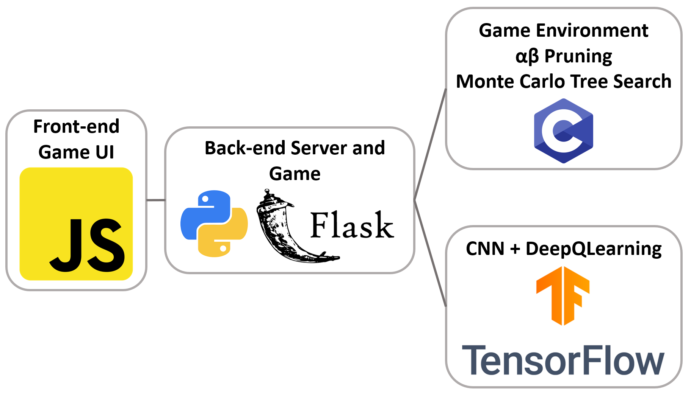
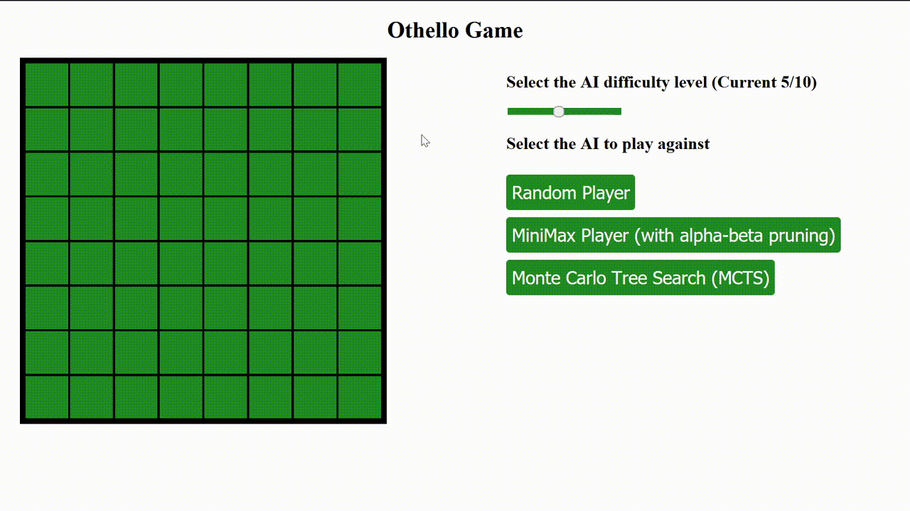
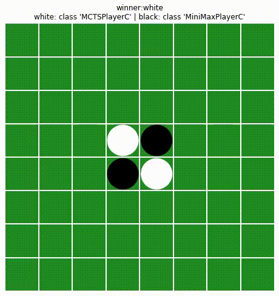

# othello-rl

This repo contains implementation of a few Othello-AI agents and a UI to play against them. Currently, the following AI are available
* Minimax (alpha-beta Pruning)
* MCTS (Monte Carlo Tree Search)



The Front-end of the game is implemented in JS, the server in Flask + Python, and the AI and some of the game environment logic is implemented in C.
To use the different AI, dll files need to be placed in the repo directory ( 
[Minimax](https://github.com/DragonWarrior15/othello-rl/releases/download/0/minimax.dll), 
[MCTS](https://github.com/DragonWarrior15/othello-rl/releases/download/0/mcts.dll),
[Game Environment](https://github.com/DragonWarrior15/othello-rl/releases/download/0/game_env_fn.dll)
)<br>
Run `python game_server.py` to start the UI



### AI and game environment files
The game environment is available in multiple flavors in the file [game_env.py](/game_env.py)
* `StateEnv`: Uses raw 2D matrix representation of the game
* `StateEnvBitBoard`: Uses bitboards to represent the game along with bit operations for the game logic
* `StateEnvBitBoardC`: Same implementation as StateEnvBitBoard but in C for faster runtime

Similarly, the AI are also available in multiple flavors in [players.py](/players.py)
* `MiniMaxPlayer`: Implements Minimax tree search with alpha-beta pruning to improve runtime, uses difference in number of coins as board heuristic
* `MiniMaxPlayerC`: Same implementation as above but in C
* `MCTSPlayer`: Implements Monte Carlo Tree Search to use random rollouts for deciding the next best move
* `MCTSPlayerC`: Same implementation as above but in C

### Runtime Comparison for AI
MCTS Comparison of Python and C at 100 simulations per move
<table>
    <head>
        <tr>
        <th> Game Environment Type </th><th> Player Type</th><th>Time</th>
        </tr>
    </head>
    <tr><td> Python </td><td> Python with Python Environment</td><td>0.16 it/s</td></tr>
    <tr><td> C </td><td> Python with C Environment</td><td>0.33 it/s</td></tr>
    <tr><td> C </td><td> C</td><td>16 it/s</td></tr>
</table>

Minimax Comparison of Python and C at max depth of 3
<table>
    <head>
        <tr>
        <th> Game Environment Type </th><th> Player Type</th><th>Time</th>
        </tr>
    </head>
    <tr><td> Python </td><td> Python with Python Environment</td><td>2 it/s</td></tr>
    <tr><td> C </td><td> Python with C Environment</td><td>5 it/s</td></tr>
    <tr><td> C </td><td> C</td><td>130 it/s</td></tr>
<tr><td> C </td><td> C (max depth 4)</td><td>43 it/s</td></tr>
</table>

For the UI, the max depth of Minimax is capped at 9, while the number of simulations of MCTS is capped at 50000 to keep the AI move generation almost realtime.

### DQN AI
A dqn version of the AI is also implemented in [players.py](/players.py) under DeepQLearningAgent. To train this agent, run `python training_dqn.py`.
This AI trains itself against a random player for set number of episodes using Convolutional Neural Network and Deep Q Learning.

### Game Recording
The `Game` class also provides the facility to record game play between two players using `matplotlib` and `FFmpeg` (git-2019-12-01-637742b).
```python
from game_env import Game
from players import MCTSPlayerC, MiniMaxPlayerC, RandomPlayer
board_size = 8

# initialize classes
p1 = MCTSPlayerC(board_size=board_size, n_sim=50000)
p2 = MiniMaxPlayerC(board_size=board_size, depth=9)
g = Game(player1=p1, player2=p2, board_size=board_size)
# play and record
g.play()
g.record_gameplay(path='images/gameplay_mcts_minimax.mp4')
```



### Monte Carlo Tree Search
A stochastic method that uses simulations to determine the next best move to play. It is divided into 4 steps. Whenever we are given the task of choosing a move, we will initiate a fresh instance of MCTS.<br>
The base idea of MCTS is to build a tree of game states by randomly choosing moves for either side. In this process, We may not be able to explore all the nodes (limited by total number of simulations), but for the nodes just after the root node (current state for which we have to choose the move) we expect to have a good idea of approximate win probabilities.
<ol>
    <b><li value="1">Selection</li></b>
    <p>Select a node in the tree that is neither a leaf node, nor fullly explored.
    <ul>
        <li>Leaf node is a terminal node of the game</li>
        <li>A node is not fully explored until all of it's children have been visited at least once.</li>
    </ul>
    During the starting simulations, we will always choose the root node for this, and keep choosing it until all it's children have been visited at least once. If a node has been fully explored, we will select a child node using the UCB1 statistic. The one with highest value will be chosen among all the child nodes.</p>
    <b><li value="2">Expansion</li></b>
    <p>Select one of the child node for this node which is unexplored. If all the child nodes have been explored, then we must be at the selection step itself. This child node represents one of the available leval moves. We play this move on the current state and get the updated board state variables.</p>
    <b><li value="3">Simulation</li></b>
    <p>On this new node added to the game tree in the exapansion step, start playing till the end by randomly choosing moves. In case the node is a terminal node, we skip this step. This constitutes one full run of the game starting from this new node.</p>
    <b><li value="4">Backpropagation</li></b>
    <p>One run of the game has ended and we update a couple of attributes of all the nodes (starting from the node added in the expansion phase, going all the way back up to the root node) that participated in this entire game run.
    <ul>
        <li>Add 1 to n, the attribute denoting how many times this node has taken part in a simulation.</li>
        <li>Update the attribute N for all the children of this node. N denotes the total simulations the parent has participated in.</li>
        <li>Update the attribute w denoting the number of wins this node participated in. w is updated by 1 when this node's color is opposite to the winner. This inversion happens because when choosing a child node in the selection phase, the UCB1 value helps us choose the best node to pick. This involves a component of the win rate. We want this win rate to represent the parent node's color win rate. The color of the parent node will be opposite to the current node. Hence the inversion</li>    
    </ul>
    </p>
</ol>
